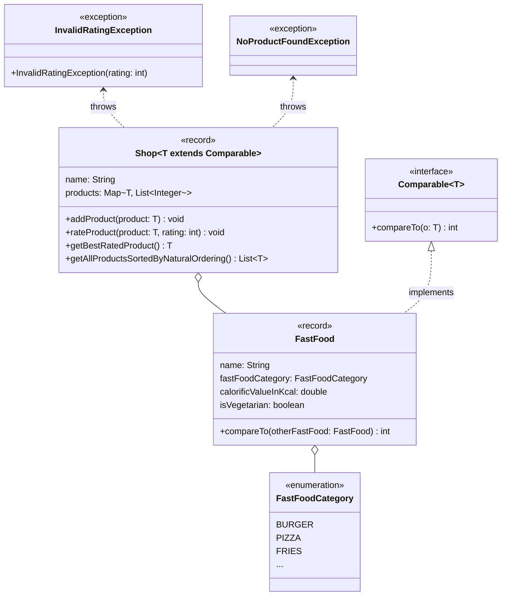

Setze das abgebildete Klassendiagramm vollständig um. Erstelle zum Testen eine
ausführbare Klasse.

## Klassendiagramm

## Allgemeine Hinweise

- Aus Gründen der Übersicht werden im Klassendiagramm keine Getter und
  Object-Methoden dargestellt
- So nicht anders angegeben, sollen Konstruktoren, Setter, Getter sowie die
  Object-Methoden wie gewohnt implementiert werden

## Hinweis zur Klasse _FastFood_

Die Methode `int compareTo(otherFastFood: FastFood)` soll so implementiert warden, dass damit FastFood absteigend nach den Kalorien sortiert warden kann.

## Hinweise zur Klasse _Shop_

- Die Methode `void addProduct(product: T)` soll das eingehende Produkt zum Sortiment hinzufügen
- Die Methode `void rateProduct(product: T, rating: int)` soll dem eingehenden Produkt die eingehende Bewertung hinzufügen. Für den Fall, dass das eingehende Produkt nicht im Sortiment vorhanden ist, soll die Ausnahme `NoProductFoundException` ausgelöst warden und für den Fall, dass die eingehende Bewertung nicht im Bereich 1 bis 5 liegt, soll die Ausnahme `InvalidRatingException` ausgelöst werden 
- Die Methode `Burger getBestRatedProduct()` soll das Produkt mit der höchsten
  Bewertung zurückgeben
- Die Methode `List<T> getAllProductsSortedByNaturalOrdering()` soll alle Produkte sortiert nach ihrer natürlichen Ordnung zurückgeben
